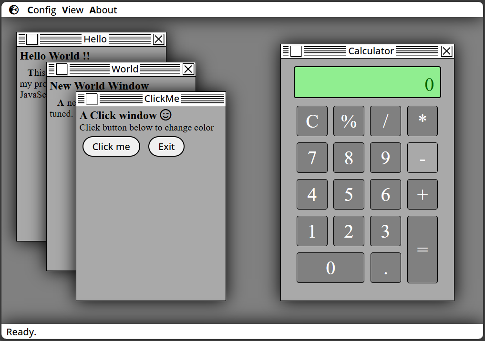

# 🖥️ Retrosystem

**Retrosystem** is an interactive web interface inspired by retro operating systems. This project highlights DOM manipulation using pure JavaScript, without frameworks, and offers an immersive user experience with dynamic windows, visual effects, and modular logic.

## 🚀 Project Objectives

- Simulate a retro desktop environment in the browser
- Dynamically manipulate HTML elements via the DOM
- Handle user events (clicks, dragging, closing)
- Create a responsive and stylish interface

## 🧰 Technologies Used

- HTML5
- CSS3
- JavaScript (DOM, events, modular functions)

## 📸 Preview

  
> Interface with interactive windows, control buttons, and a retro vibe.

Access a deployed version [Here](https://olirati.github.io/retrosystem/)

## 🧠 Main Features

- Opening and closing dynamic windows
- Moving windows with z-index management
- CSS visual effects and transitions
- Modular organization of JavaScript code
- Stylish interface with retro icons and typography

## 📂 Project Structure

  Retrosystem/
  ├── index.html
  ├── style.css
  ├── script.js
  ├── assets/
  │ └── icons/
  └── README.md

## 📈 Possible Improvements

- Add a notification system
- Integrate localStorage to save the state
- Create a task manager or an integrated mini-game
- Enhanced accessibility (keyboard shortcuts, ARIA)

## 👨‍💻 Author

**olirati**
Web & Mobile Web Developer in career transition

📧 [olirati@free.fr](mailto:olirati@free.fr)
